# WebSource
Made by Shuai Zheng Advisor: Prof. Homayoun Yousefi'zadeh

Prerequement:

To simulate the website, below are required:

1. HTML IDE (Sublime, Atom, and so on )
    Can be downloaded from webite:
    https://www.sublimetext.com/

2. Browser (Chrome, firefox, and so on )
    https://www.google.com/chrome/

Test (Step 1):

With above preparation done, edit the website with following steps:

1.  Open index.html using sublime to edit, Open index.html using chrome or firefox to display the website.

2.  from line 97 to 149 is navigation part

    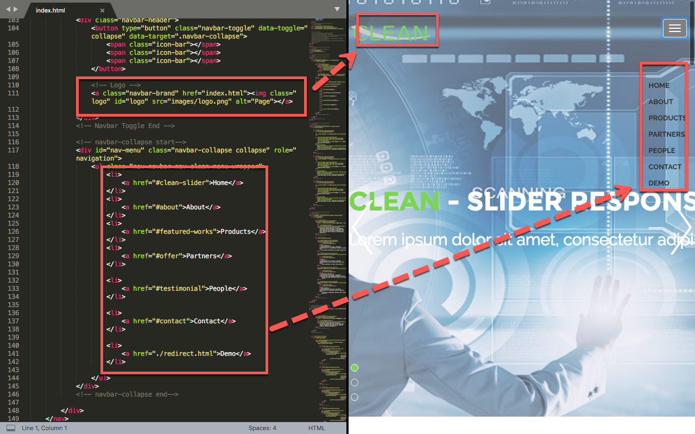

3.  from line 157 to 220 is the slides part

    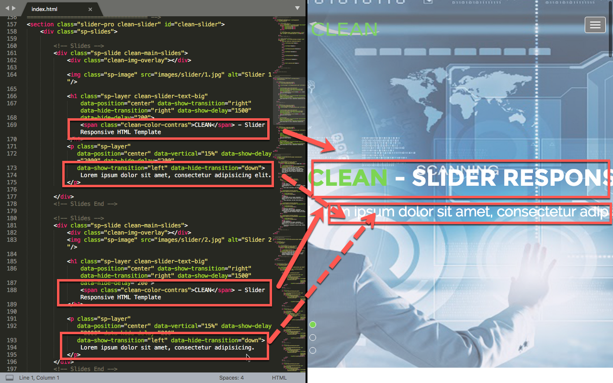

4.  from line 227 to 286 is the about part

    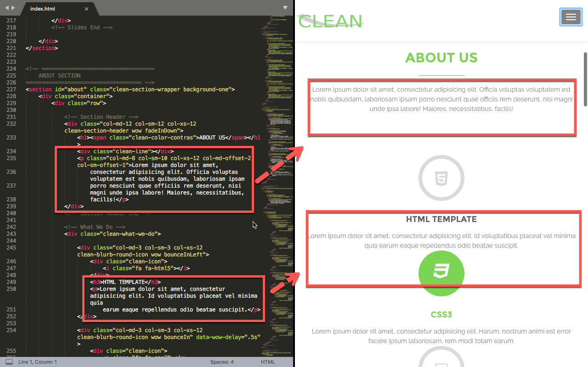

5.  from line 289 to 430 is the product part, the image is local at images/featured-work

    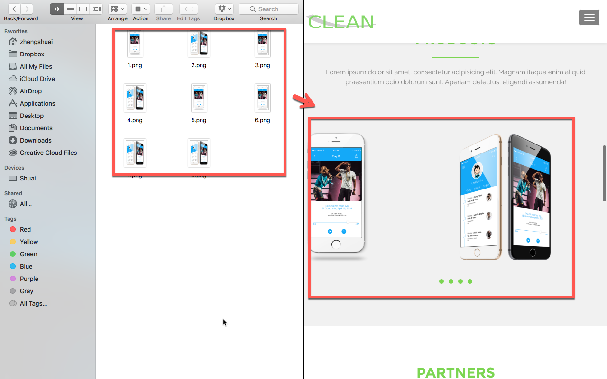

6.  from line 433 to 473 is the  partner part.

    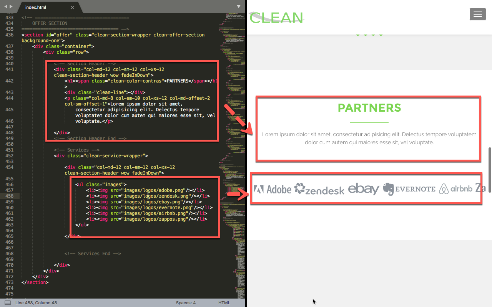

7.  from line 479 to 582 is the people part.

    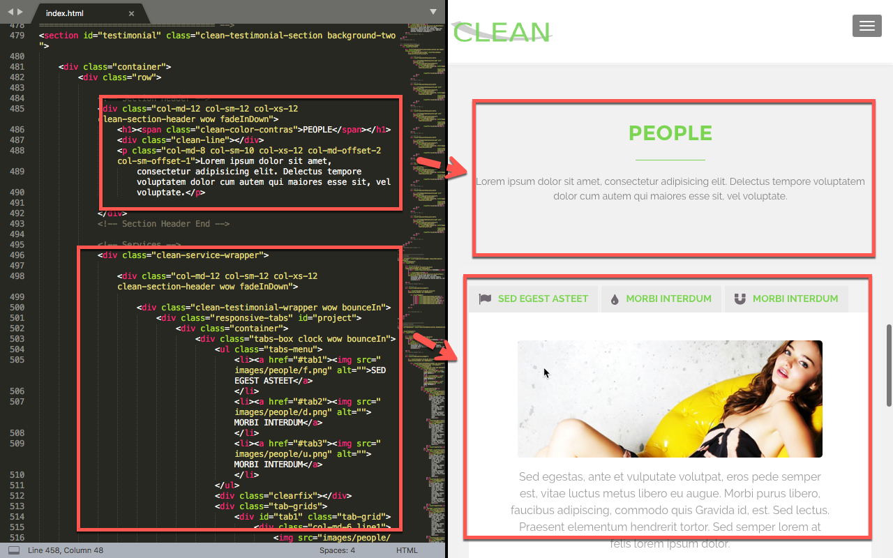

8.  from line 649 to 680 is the footer part.

    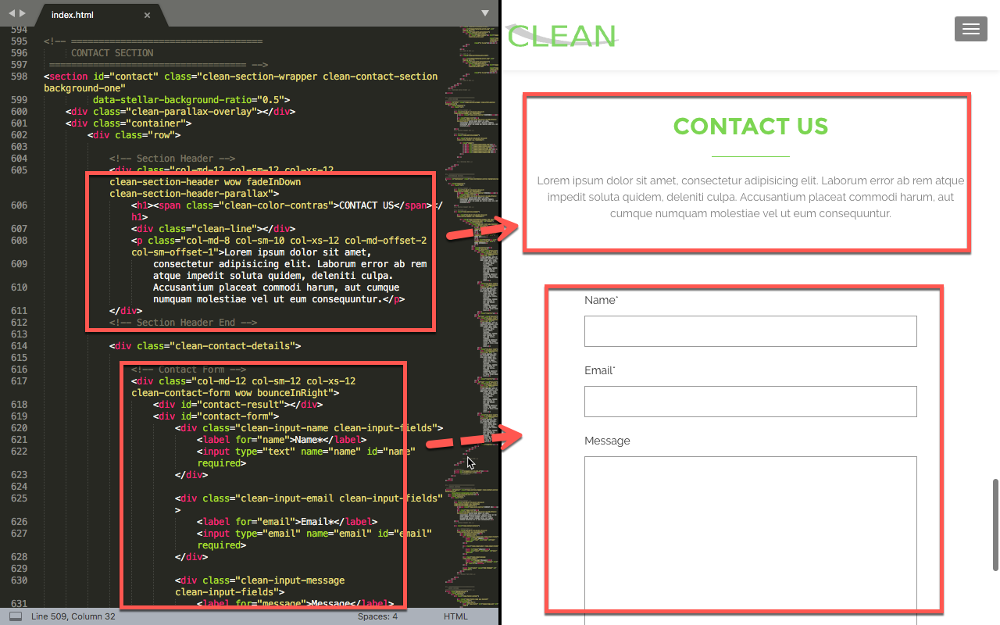

9.  in the redirect.html change url to redirect url.

    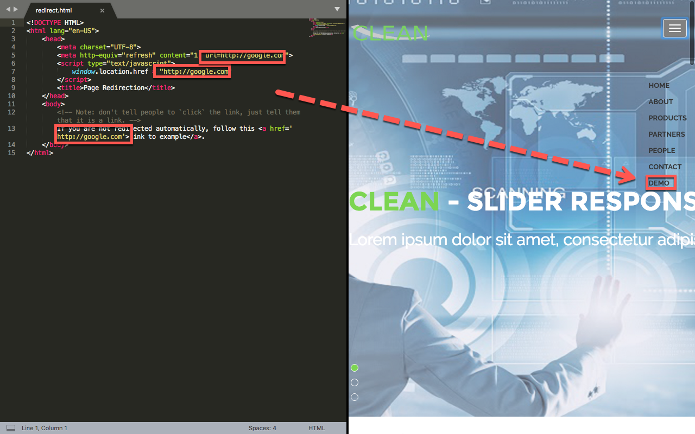

Deploy Using Cpanel(Step 2):

10.  compress .html, images, js, and css file inside one .zip file

    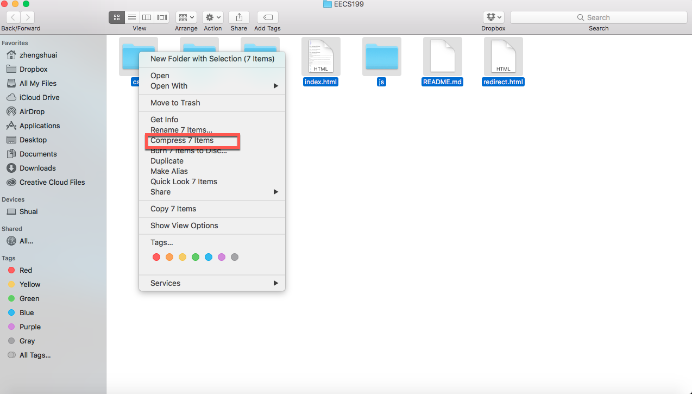

11. buy host server such as (https://www.bluehost.com/) or (https://www.hostgator.com).

12. after buy host server, login in and click cpanel.

13. use file manager to upload file.

    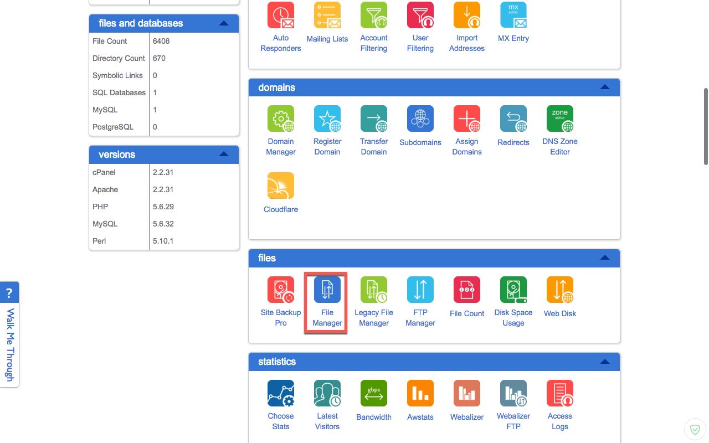

14. click submit

    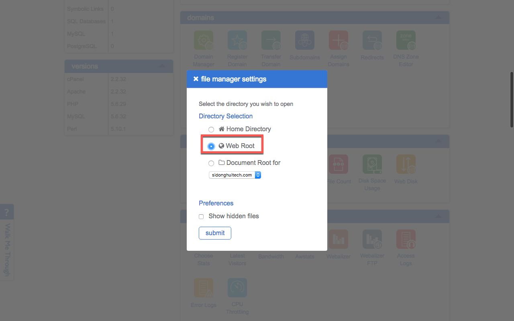

15. click upload

    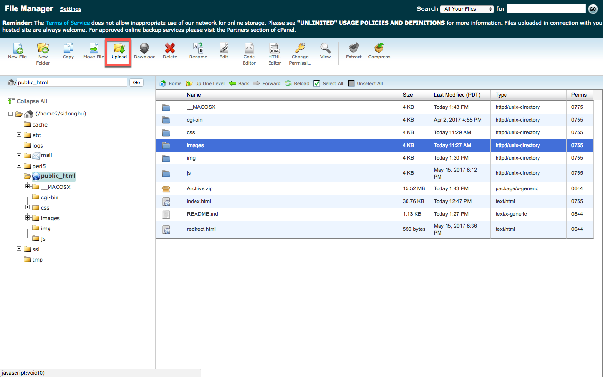

15. select zip file

    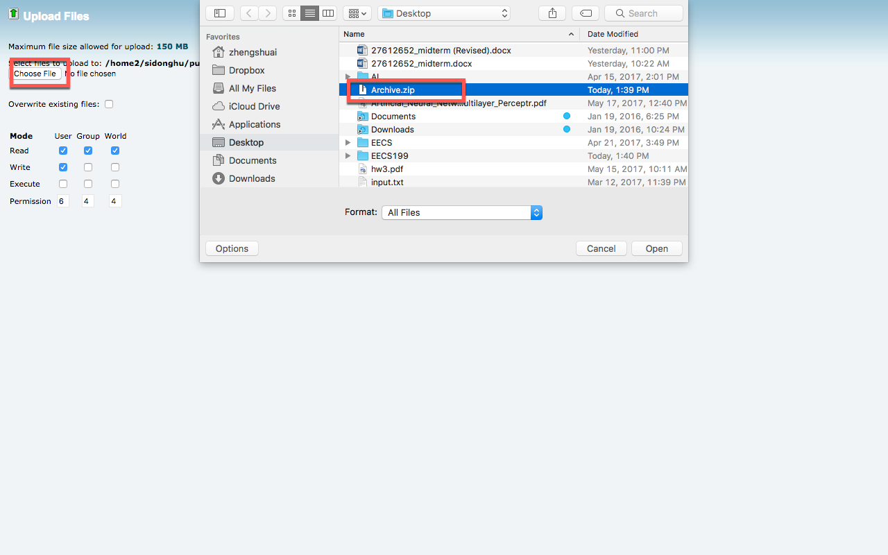

15. extract zip file

    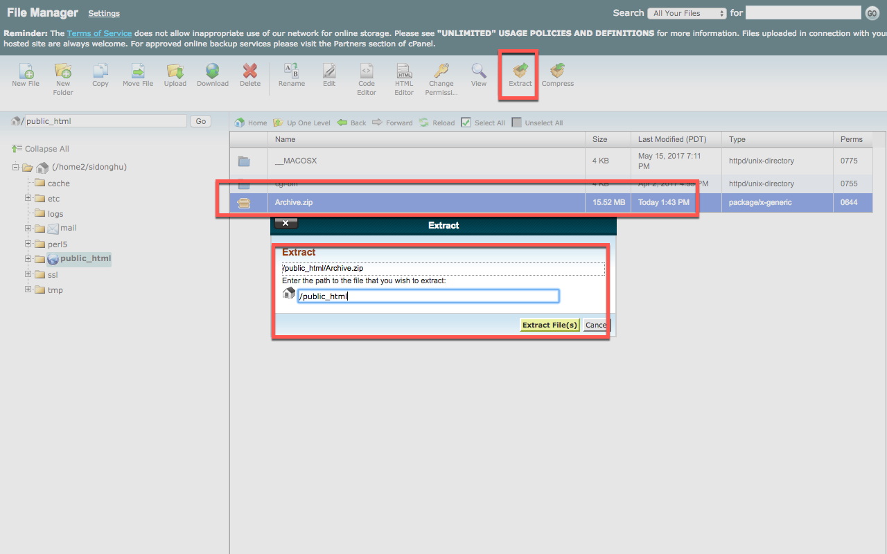

16. redirect domain to domian/index.html in the cpanel

    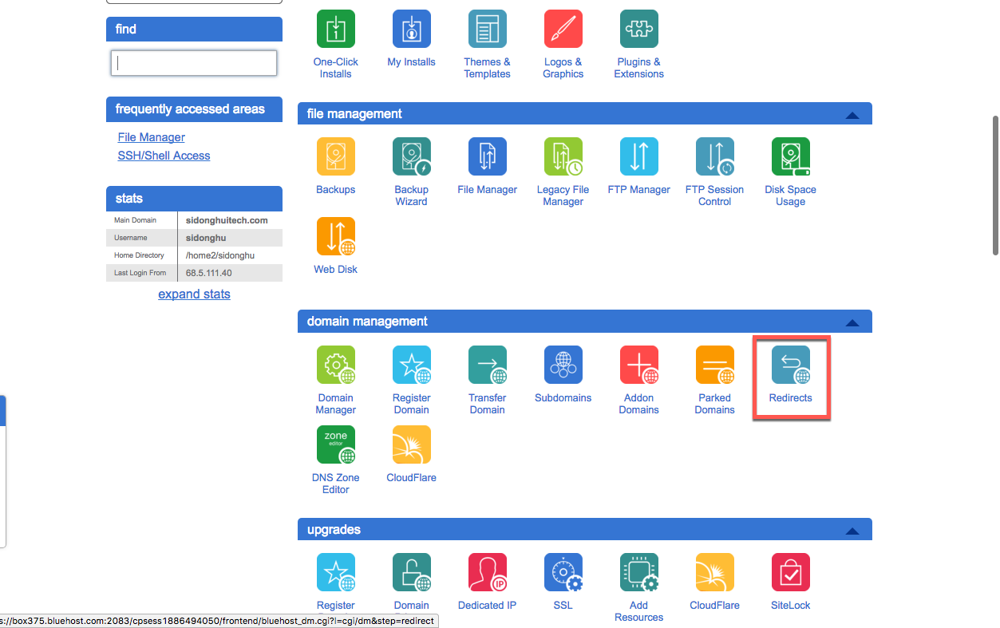

17. after click redirect and set redirect page

    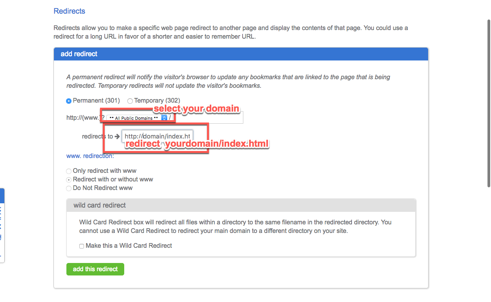
